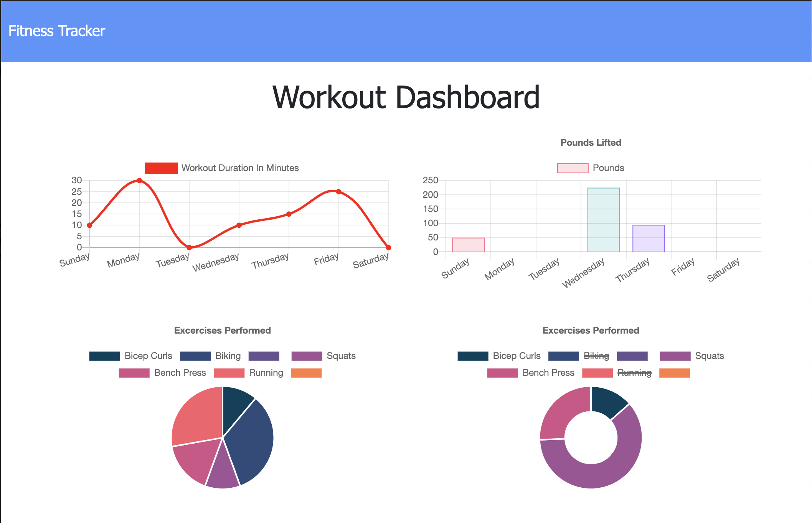

# Workout Tracker


## Deployed Site:




---

## Description

  *The what, why, and how:*

`PROJECT DESCRIPTION:` We were given some starter code (including pre-built HTML and some Javascript) and tasked with making the application functional. In order to do this, I had to create a few different files including a models folder, a routes folder (in conjunction with api.js), and a server.js file to kick off the application. The purpose of this Application is so that a user can log and track their excercises, and be returned four tables that display their data. The data is stored in a mongoDB database.


`WHO IS IT FOR?:` For those who want to be able to view create and track daily workouts and log multiple exercises in a workout on a given day.

 - *An issue I ran across in this project is the 'stats' tables. I did not write the starter code, so I'm not entirely sure why the tables skip days. I attempted to solve this problem however I was not able to fix it before the deadline.*

  ---


## Table of Contents

  - [Deployed Site](#deployed-site)
  - [Description](#description)
  - [Usage](#usage)
  - [Directory Structure](#directory-structure)
  - [Questions](#questions)
 
 ---


## Usage
  *Instructions and examples for use:*

To run this application:
1. Visit the deployed link above

2. Choose your workout type (Cardio or Resistance), and enter in the name of the workout and the accompanying attributes (i.e. reps, weight, duration, etc.)

4. Either add another exercise, or press the 'complete' button to finish your workout

5. Click the 'Dashboard' button to see your personalized tables!
---


## Directory Structure
```
├── models
│   └── Workout.js
│   └── index.js
│ 
├── node_modules
│ 
├── public
│   └── api.js 
│   └── exercise.html
│   └── exercise.js 
│   └── index.html
│   └── index.js
│   └── stats.html
│   └── stats.js 
│   └── style.css
│   └── workout.js      
│
├── rmImgs
│
├── routes
│   └── api-routes.js
│   └── html-routes.js
│
├── seeders
│   └── seed.js
│ 
├── package.json
│ 
│ 
├── README.md
│
│  
└── server.js
```

---


## Questions?

  *For any questions about this application, please contact me via the information below:*

  * **GitHub:** https://github.com/rachelkline
  
  * **Email:** rachel_kline@icloud.com

---
  <br>

  [Icons provided by https://fontawesome.com/]